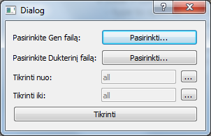
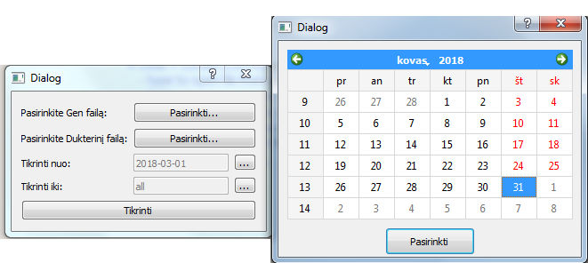
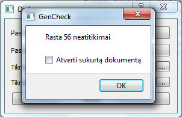

# Gen_File_Check
Program for comparing file differences and outputting a report.

Compiled with Qt 5.10.0 MinGw 32bit
# Description

Required files(not present in the repository):

-Eip Master file (which has all the products) (A)

-Eip file which has at least one subset of master file (B)

Main goal of the program is to check whether the subsets have correct data in them. Master and subsets are tied with a unique ID. Each record also has its own "place" e.g. record #84 must be in 1 and 2 manufacturers lists (subset) so if we find record #84 only in the 1 subset in our B file that counts as a mismatch therefore a mistake, which is saved in a report file.

 
 
 
 
[Demo report file](screens/demo_output.xlsx)
